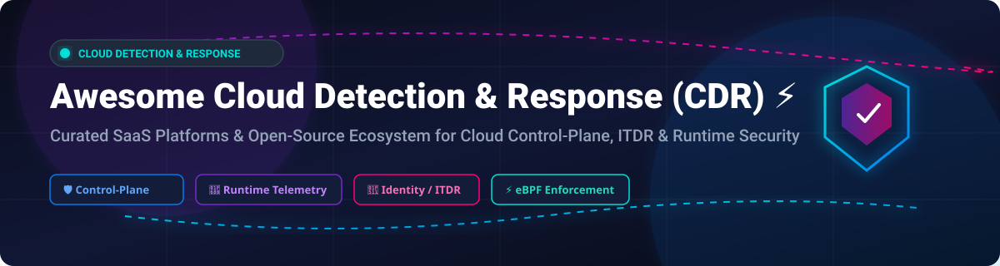

# Awesome Cloud Detection & Response (CDR) ⚡

      

## 🛡️ Top Cloud Detection & Response (CDR) Platforms & Tools Ecosystem

**A Curated List of Enterprise SaaS Platforms & Open-Source Cloud Security GitHub Projects**

*Focused on Cloud Control-Plane Detection, eBPF Runtime Threat Detection, Identity Threat Detection & Automated Incident Response (ITDR/CDR).*

**Last updated: September 2026** 📅

---

### 🔍 Overview & SEO Keywords

Welcome to the definitive awesome list for **Cloud Detection & Response (CDR)**, **Cloud Workload Protection Platforms (CWPP)**, **Cloud Security Posture Management (CSPM)**, and **Identity Threat Detection & Response (ITDR)**. This repository tracks notable enterprise **SaaS platforms** and **open-source GitHub projects** designed to help cybersecurity teams, SOC analysts, and platform engineers detect active threats inside AWS, Azure, GCP, and Kubernetes environments in real time.

---

## 📑 Table of Contents

- [📊 Sector Overview & Market Dynamics](#-sector-overview--market-dynamics)
- [🏢 Enterprise SaaS Platforms](#-enterprise-saas-platforms)
- [🔓 Open-Source GitHub Projects](#-open-source-github-projects)
  - [⚡ Runtime Threat Detection Engines](#-runtime-threat-detection-engines)
  - [☁️ Cloud Control-Plane & Forensics](#️-cloud-control-plane--forensics)
  - [☸️ Kubernetes Runtime Detection](#️-kubernetes-runtime-detection)
  - [🌐 Network Detection & Response (NDR)](#-network-detection--response-ndr)
  - [🛡️ Cloud Security & posture management](#️-cloud-security--posture-management)
- [🤝 How to Contribute](#-how-to-contribute)
- [💖 Support & Sponsorship](#-support--sponsorship)
- [📈 Star History](#-star-history)
- [⚠️ Disclaimer](#️-disclaimer)

---

## 📊 Sector Overview & Market Dynamics

> [!NOTE]
> **Market Size & Structure**: The global Cloud Detection & Response (CDR) market is estimated at **$7.2 Billion in 2026** (growing at ~22.5% CAGR). The market is **moderately fragmented**, undergoing rapid consolidation as hyperscalers (Google/Wiz, Microsoft) and legacy EDR titans (CrowdStrike, Palo Alto Networks) acquire specialized pure-play startups (Gem Security, Bionic, Flow Security). High barriers to entry around cloud-native eBPF telemetry and graph-based identity correlation create a "winner-take-most" dynamic among top-tier platform leaders.

---

## 🏢 Enterprise SaaS Platforms

Below is a curated comparison of leading commercial Cloud Detection & Response (CDR) vendors, sorted by **Company Size / Valuation / Revenue** in descending order.

| 🏢 Platform | 💰 Company Size / Valuation / Revenue | 💵 Starting Tier Pricing | 🎁 Free Tier / Trial Limit | 🎯 Key Focus & Strengths |
| :--- | :--- | :--- | :--- | :--- |
| **[Microsoft Defender for Cloud](https://www.microsoft.com/)** | **$3.1 Trillion Market Cap** ($245B+ Annual Rev) | **$0.0039/server/hr** (~$3/server/mo for CSPM; Defender for Servers Plan 2 starts at $15/server/mo) | **30-Day Free Trial** (Full features across Azure, AWS, and GCP endpoints) | **Best Azure Economics**: Native control-plane audit log analysis & Defender XDR multicloud correlation. |
| **[Palo Alto Networks (Prisma Cloud)](https://www.paloaltonetworks.com/)** | **$115 Billion Market Cap** ($8.0B+ Annual Rev) | **$90/credit/yr** (Prisma Business tier starts at ~$12,000/yr minimum commit) | **30-Day Free Trial** (Includes 1,000 credit allocation for evaluation) | **Best Platform Breadth**: Unifies control-plane auditing with host runtime telemetry & Cortex XDR SSE. |
| **[CrowdStrike Falcon Cloud Security](https://www.crowdstrike.com/)** | **$85 Billion Market Cap** ($3.9B+ Annual Rev) | **$150/workload/yr** (Falcon Cloud Security starting package from ~$15,000/yr) | **15-Day Free Trial** (Falcon platform trial with Cloud Security module enabled) | **Best Response Automation**: Real-time event streaming eliminating log latency; top adversary intel. |
| **[Wiz (with Gem Security)](https://www.wiz.io/)** | **$32 Billion Valuation** (Acquired by Google in 2026; $1.0B ARR) | **$24,000/yr** (Wiz Essential tier covering up to 100 cloud workloads) | **Custom PoC / Interactive Demo** (No permanent free tier; structured 14 to 30-day proof-of-concept) | **Best Contextual Correlation**: Combines real-time runtime alerts with graph identity & network vulnerability context. |
| **[Sysdig](https://sysdig.com/)** | **$2.5 Billion Valuation** (~$250M ARR) | **$20/node/month** ($240/node/yr for Sysdig Secure agent runtime protection) | **30-Day Free Trial** (Full access to Sysdig Secure & Monitor, no credit card required) | **Best Real-Time Detection**: Powered by CNCF Falco eBPF runtime engine for container escape detection. |
| **[Orca Security](https://orca.security/)** | **$1.8 Billion Valuation** (~$120M ARR) | **$15,000/yr** (Starting tier covering up to 250 assets/workloads) | **30-Day Free Trial** (Agentless SideScanning across AWS, Azure, and GCP) | **Best Agentless Telemetry**: 100% agentless visibility across compute, storage, and IAM risk analysis. |
| **[Uptycs](https://www.uptycs.com/)** | **$600 Million Valuation** (~$45M ARR) | **$6/asset/month** (~$72/asset/yr starting package for cloud & endpoint) | **14-Day Free Trial** (Full osquery + eBPF telemetry suite access) | **Best Unified Telemetry**: Normalizes osquery and eBPF data across cloud workloads and containers. |
| **[Stream.Security](https://www.stream.security/)** | **$200 Million Valuation** (~$15M ARR) | **$10,000/yr** (Starting base plan for real-time Cloud Twin infrastructure tracking) | **14-Day Free Trial** (Includes real-time change tracking and Cloud Twin modeling) | **Best Cloud-Model Real-Time**: Dynamic Cloud Twin tracks infrastructure changes instantly upon API modifications. |
| **[Skyhawk Security](https://www.skyhawk.security/)** | **$150 Million Valuation** (~$12M ARR) | **$8,000/yr** (Purpose-built CDR package spun out of Radware) | **14-Day Free Trial** (Autonomous CDR analysis on CloudTrail & Activity Logs) | **Best Purpose-Built CDR**: ML-driven correlation of API anomalies into complete attack sequences & ITDR. |
| **[Sweet Security](https://www.sweet.security/)** | **$100 Million Valuation** (~$8M ARR) | **$7,500/yr** (eBPF runtime sensor package for cloud-native workloads) | **14-Day Free Trial** (Lightweight sensor deployment for runtime workload analysis) | **Best Runtime-Sensor CDR**: Deep runtime detection via lightweight eBPF sensor filtering out cloud noise. |

---

## 🔓 Open-Source GitHub Projects

Curated open-source projects for self-hosted Cloud Detection & Response, eBPF runtime monitoring, and cloud forensics, sorted by **GitHub Stars_Count** in descending order. 🌟

### ⚡ Runtime Threat Detection Engines

- **[Falco](https://github.com/falcosecurity/falco)**  🌟
  - **The CNCF-graduated runtime threat detection engine and gold standard for container security.** Donated by Sysdig, Falco monitors Linux system calls in real time against customizable rule sets.
  - **Key Capabilities**: Detects container escapes (T1611), privilege escalation, unauthorized shell executions, and Kubernetes audit log anomalies. Extensible via Falcosidekick and Falco Talon. **Apache-2.0**.

- **[Tetragon](https://github.com/cilium/tetragon)**  🌟
  - **eBPF-native runtime security and observability enforcement engine by Isovalent (Cisco).**
  - **Key Capabilities**: In-kernel enforcement capable of killing malicious processes before syscall completion. Implements Kubernetes Identity Aware TracingPolicies with minimal p99 overhead. **Apache-2.0**.

- **[Tracee](https://github.com/aquasecurity/tracee)**  🌟
  - **eBPF-driven runtime security and forensic data collection tool by Aqua Security.**
  - **Key Capabilities**: Uses eBPF technology to trace system calls and events at runtime, evaluating behavior against built-in signatures and custom Rego policies. **Apache-2.0**.

- **[KubeArmor](https://github.com/kubearmor/KubeArmor)**  🌟
  - **LSM-based container runtime security enforcement engine (AppArmor, SELinux, BPF-LSM).**
  - **Key Capabilities**: Restricts system capabilities, file accesses, and process executions at the Linux kernel level. **Apache-2.0**.

- **[Sysdig OSS](https://github.com/draios/sysdig)**  🌟
  - **Open-source system-level exploration and capture engine.**
  - **Key Capabilities**: Deep system call auditing and forensic capture file creation for Linux workloads. **Apache-2.0**.

---

### ☸️ Kubernetes Runtime Detection

- **[Kubescape node-agent](https://github.com/kubescape/node-agent)**  🌟
  - **eBPF-based Kubernetes runtime detection agent with CEL rules and malware scanning.**
  - **Key Capabilities**: Evaluates security rules using Kubernetes CEL expressions, builds behavioral baselines, performs ClamAV malware scanning, and generates real-time SBOMs with Syft. **Apache-2.0**.

---

### 🌐 Network Detection & Response (NDR)

- **[Clear NDR Community (SELKS)](https://github.com/StamusNetworks/SELKS)**  🌟
  - **Production-grade open-source Suricata Network Detection & Response platform with AI interfaces (MCP).**
  - **Key Capabilities**: Complete turnkey NDR solution combining Suricata 8.0, OpenSearch, Arkime packet capture, and Scirius threat hunting UI. **GPLv3**.

---

### ☁️ Cloud Control-Plane & Forensics

- **[Cloud Custodian](https://github.com/cloud-custodian/cloud-custodian)**  🌟
  - **Stateless open-source rules engine for real-time cloud security, governance, and automated response.**
  - **Key Capabilities**: Real-time evaluation of AWS CloudTrail, Azure Event Grid, and GCP Audit Logs with automated remediation actions. **Apache-2.0**.

- **[Prowler](https://github.com/prowler-cloud/prowler)**  🌟
  - **Multi-cloud security assessment, auditing, and incident response tool.**
  - **Key Capabilities**: Over 300+ security controls mapping to MITRE ATT&CK, CIS Benchmarks, and SOC2 across AWS, Azure, GCP, and Kubernetes. **Apache-2.0**.

- **[Argus](https://github.com/nssriraam/argus)**  🌟
  - **Open-source AWS & Azure cloud forensics and threat detection engine.**
  - **Key Capabilities**: Correlates CloudTrail and Azure Activity logs against MITRE ATT&CK attack chains with zero infrastructure cost. **Apache-2.0**.

---

## 🤝 How to Contribute

Contributions are welcome! Please follow these simple guidelines:

1. 🍴 **Fork** this repository.
2. 📝 **Add/edit** entries in `README.md` following the tabular/structured format.
3. 🔬 **Verify** links, pricing data, and GitHub Stars_Counts.
4. 🚀 **Submit a Pull Request** with a concise title and description.

Check out our full awesome meta-list: [Awesome-Awesome-Awesome](https://github.com/ishandutta2007/Awesome-Awesome-Awesome)! ⭐

---

## 💖 Support & Sponsorship

If you find this repository helpful for your cloud security architecture, threat hunting, or research, consider supporting the maintainer:

- 🌟 **Star & Fork** this repository to help others discover it!
- 📢 **Share** with your cybersecurity team and network.
- ☕ **Buy me a coffee / Sponsor**: Support ongoing maintenance on the [GitHub Sponsor Dashboard](https://github.com/sponsors/ishandutta2007).

Thank you for building a safer cloud environment together! 🙏

---

## 📈 Star History

---

## ⚠️ Disclaimer

- This list is **community-curated** for educational, architectural, and security evaluation purposes.
- Commercial trademarks belong to their respective owners.
- **Open-Source vs Commercial Reality**: While open-source projects like Falco and Tetragon offer world-class runtime detection, enterprise SaaS CDR platforms provide unified multi-cloud correlation, ITDR, automated response workflows, and managed threat intelligence out of the box.
